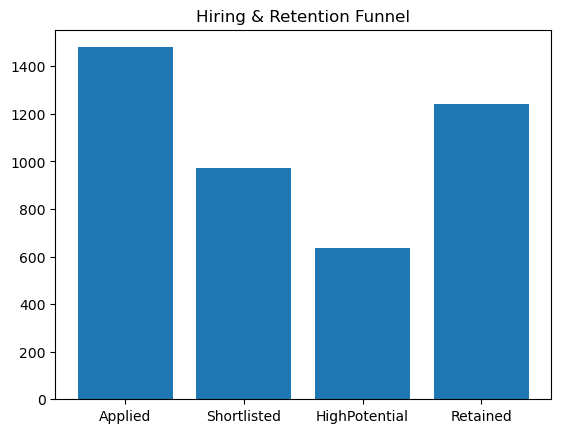
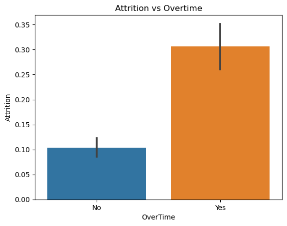
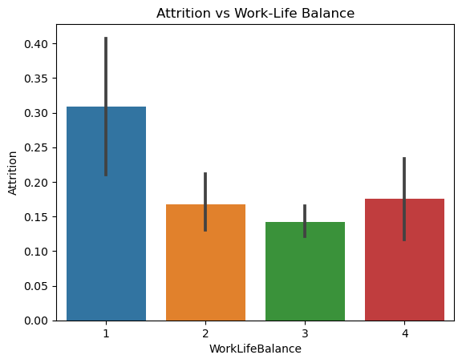
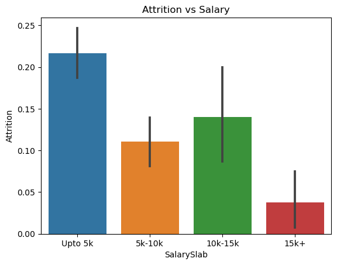
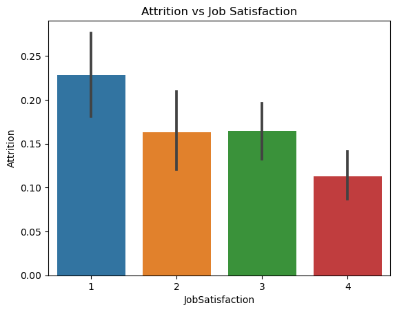

# 📊 Hiring & Retention Funnel Analysis

## 📌 Problem Statement
Companies often struggle to understand why employees leave and how hiring decisions impact long-term retention. This project aims to analyze employee data and identify key factors influencing attrition.

---

## 🎯 Objective
- Analyze employee attrition patterns  
- Simulate a hiring funnel  
- Identify key drivers of employee turnover  
- Provide data-driven business insights  

---

## 🧠 Approach
- Data cleaning and preprocessing  
- Feature engineering (creating funnel stages)  
- Exploratory Data Analysis (EDA)  
- Data visualization using charts  
- Business insight generation  

---

## 📊 Hiring Funnel Summary

| Stage           | Count |
|----------------|------|
| Applied        | 1480 |
| Shortlisted    | 972  |
| High Potential | 586  |
| Retained       | 1242 |

---

## 📈 Key Visualizations

### 🔹 Funnel 

### 🔹 Attrition vs Overtime

---

### 🔹 Attrition vs Work-Life Balance

---

### 🔹 Attrition vs Salary

---

### 🔹 Attrition vs Job Satisfaction

---

## 🔍 Key Insights

- Employees working overtime exhibit significantly higher attrition rates, indicating workload imbalance as a major factor  
- Poor work-life balance leads to increased employee turnover  
- Lower salary levels are associated with higher attrition  
- Employees with low job satisfaction are more likely to leave  
- Employee retention is influenced by a combination of compensation, workload, and satisfaction factors  

---

## 🏁 Conclusion
Improving work-life balance, compensation structures, and employee engagement can significantly reduce attrition and enhance hiring quality.

---

## 💼 Business Impact
This analysis helps organizations:
- Reduce employee turnover  
- Improve hiring decisions  
- Enhance employee satisfaction  
- Optimize workforce management  

---

## 🛠️ Tools & Technologies Used
- Python  
- Pandas  
- NumPy  
- Matplotlib  
- Seaborn  
- Scikit-learn  

---

## 🚀 Project Inspiration
This project is inspired by real-world recruitment challenges.

---

## 🔗 How to Run the Project
1. Clone the repository  
2. Open the notebook (`HR Analysis.ipynb`)  
3. Run all cells step-by-step  

---

## 📬 Author
Shankar Ganesh D
